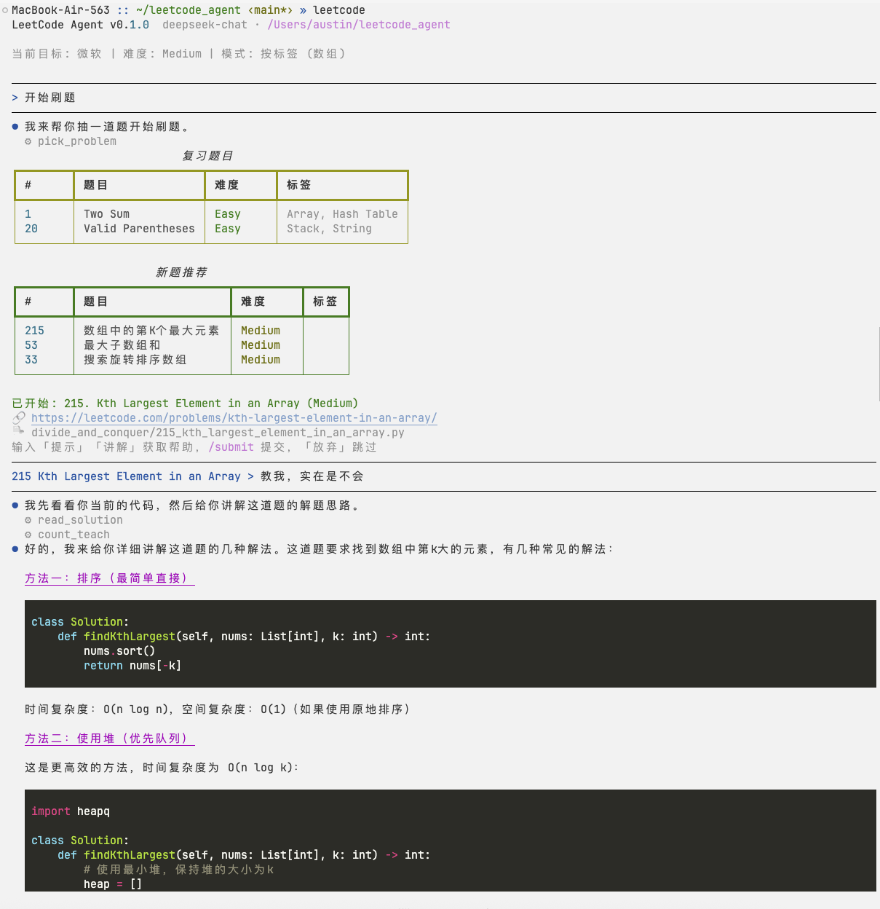
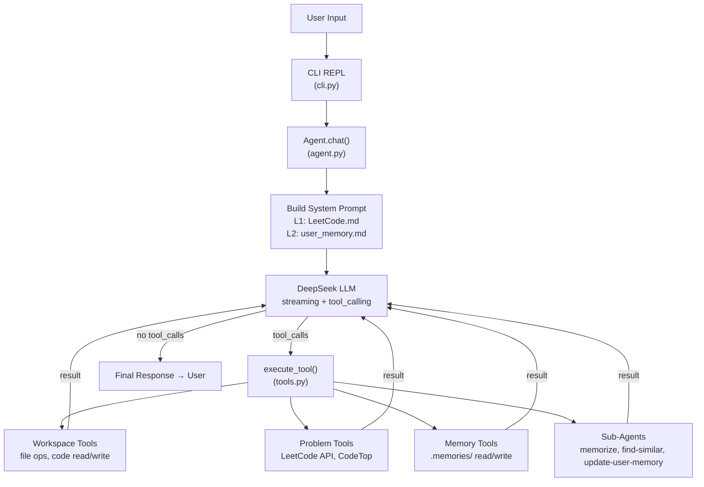
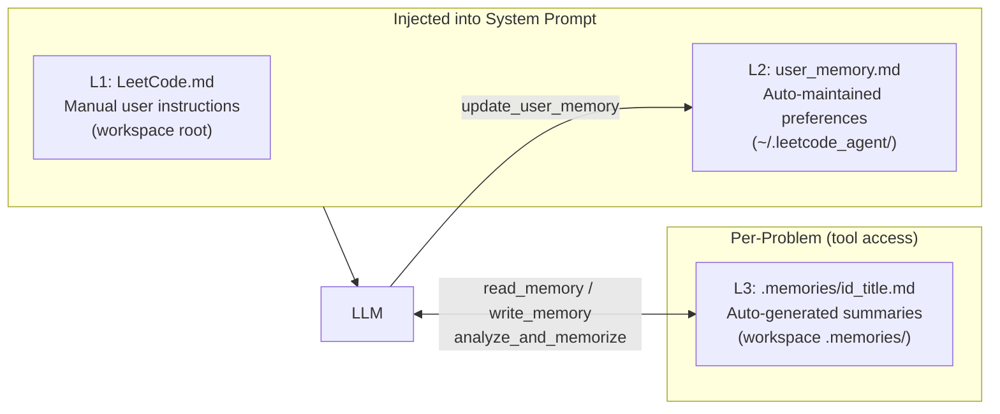

# LeetCode Agent

> Terminal-based LeetCode study assistant — chat with AI to pick problems, get hints, and build a personal memory of your progress.

**[中文](#中文)** · **[English](#english)**

---

## English

### Demo

> **Recording a GIF demo**: run `vhs demo.tape` (requires [VHS](https://github.com/charmbracelet/vhs)) or record your terminal with [asciinema](https://asciinema.org/).



*Full flow: pick a problem → get AI hints → review solution → memory auto-saved → find similar problems from history.*

---

### What It Does

A single REPL loop where you talk to an AI tutor in natural language. No memorizing commands — just say what you want:

```
> do problem 146
> give me a hint
> I'm stuck on the edge case
> show me the answer
> what similar problems have I done?
```

The agent reasons step-by-step (ReAct architecture), reads your code, checks your history, and gives contextual guidance.

---

### Features

| Feature | Description |
|---------|-------------|
| **ReAct Agent** | Multi-step reasoning + tool use — not a command router |
| **Natural language** | No commands to memorize; the agent figures out intent |
| **Auto solution files** | Creates `category/id_title.py` with problem statement + template |
| **Smart hints** | Reads your actual code and gives targeted nudges |
| **3-layer memory** | Per-session, per-user, and per-problem memory that persists across sessions |
| **Company filter** | CodeTop integration — filter high-frequency problems by target company |
| **Input history** | ↑/↓ history across sessions |
| **Web search** | Agent can search the web for algorithm explanations |

---

### Architecture

#### Agent Loop



#### Memory System



#### Codebase Layout

```
src/lc/
├── cli.py            — REPL entry point, slash commands, /config
├── agent.py          — ReAct loop (think → act → observe), streaming LLM calls
├── tool_defs.py      — Tool JSON schemas (passed to LLM)
├── tools.py          — Dispatcher (execute_tool) + imports
├── tool_impl/
│   ├── workspace.py  — File ops: read_solution, find_problem_file, append_solution, …
│   ├── problems.py   — Problem selection: search_problem, pick_problem, start_problem, …
│   ├── memory.py     — Memory: read_memory, write_memory
│   └── subagents.py  — Sub-agents: web_search, update_user_memory, find_similar, memorize
├── workspace.py      — File creation, AI classification, start_problem
├── db.py             — SQLite DAL (problem_memories + session KV)
├── models.py         — Problem dataclass + CATEGORIES
├── config.py         — Env vars, paths
├── leetcode_api.py   — LeetCode GraphQL client
├── codetop_api.py    — CodeTop high-frequency problems API
├── planner.py        — Daily plan generation
├── display.py        — Rich rendering
└── ui.py             — Arrow selector, terminal helpers
```

---

### Install

Requires Python 3.11+.

```bash
git clone https://github.com/QiqianFu/leetcode-agent.git
cd leetcode-agent
pip install -e .
```

Get a DeepSeek API key at [platform.deepseek.com](https://platform.deepseek.com/), then:

```bash
echo "DEEPSEEK_API_KEY=your_key_here" > .env
```

### Run

```bash
leetcode
```

### Slash Commands

| Command | Description |
|---------|-------------|
| `/config` | Set company, difficulty, sort order, tag |
| `/clear` | Clear screen + conversation history |
| `/help` | Show help |
| `/quit` | Exit |

Everything else is natural language.

---

### Memory System

**L1 — `LeetCode.md` (manual)**

Create `LeetCode.md` in your working directory. The agent reads it on every turn and follows your instructions.

```markdown
# My preferences

- Python only, prefer iterative over recursive
- Give small hints first, not full solutions
- Summarize time/space complexity after each problem
- Preparing for Google — focus on Medium
```

**L2 — `~/.leetcode_agent/user_memory.md` (auto)**

The agent observes your coding style and preferences across conversations and updates this file automatically. Persists through `/clear`.

**L3 — `.memories/{id}_{title}.md` (auto, per-problem)**

After each problem session, the agent writes a summary: approach, pitfalls, key insights, complexity. Used by `find_similar_problems` to connect new problems to your history.

---

### Debug Mode

```bash
DEBUG=1 leetcode
```

Logs to `~/.leetcode_agent/agent.log`: LLM latency, token usage (with cache hit rate), tool execution times, full message dumps.

```bash
tail -f ~/.leetcode_agent/agent.log
```

---

### Development

```bash
pip install -e ".[dev]"
pytest
mypy src/
```

---

## 中文

### 功能介绍

终端刷题助手 — 用自然语言和 AI 对话刷 LeetCode。AI 帮你选题、给提示、讲解思路、记录做题记忆，你只需要专注写代码。

```
> 帮我做第 146 题
> 给个提示
> 我卡在边界条件了
> 展示答案
> 我做过哪些类似的题？
```

### 特性

- **ReAct Agent** — 多步推理 + 工具调用，而不是简单的指令映射
- **自然语言** — 不用记命令，AI 自动理解意图
- **自动创建解题文件** — 按分类在当前目录创建含题目描述和模板的 `.py` 文件
- **智能提示** — 读取你的实际代码，给出针对性引导
- **三层记忆系统** — 会话、用户偏好、每题记忆，跨会话持久保存
- **高频题推荐** — 接入 CodeTop，按目标公司筛选
- **网络搜索** — Agent 可联网查找算法讲解

### 安装

```bash
git clone https://github.com/QiqianFu/leetcode-agent.git
cd leetcode-agent
pip install -e .
echo "DEEPSEEK_API_KEY=你的key" > .env
leetcode
```

API Key 申请地址：[platform.deepseek.com](https://platform.deepseek.com/)

### 记忆系统

| 层级 | 文件 | 维护方式 |
|------|------|----------|
| L1 | `./LeetCode.md` | 用户手动编写 |
| L2 | `~/.leetcode_agent/user_memory.md` | Agent 自动维护（编码偏好、薄弱点等） |
| L3 | `./.memories/{id}_{title}.md` | Agent 自动生成（每题做题总结） |

### 快捷命令

| 命令 | 说明 |
|------|------|
| `/config` | 设置公司、难度、排序、标签 |
| `/clear` | 清屏 + 清除对话历史 |
| `/help` | 帮助 |
| `/quit` | 退出 |

### 调试

```bash
DEBUG=1 leetcode
tail -f ~/.leetcode_agent/agent.log
```

### 数据存储

- `~/.leetcode_agent/leetcode.db` — SQLite，记忆索引 + 配置
- `.memories/` — 当前工作区的 Markdown 记忆文件

---

## License

[MIT](LICENSE)
